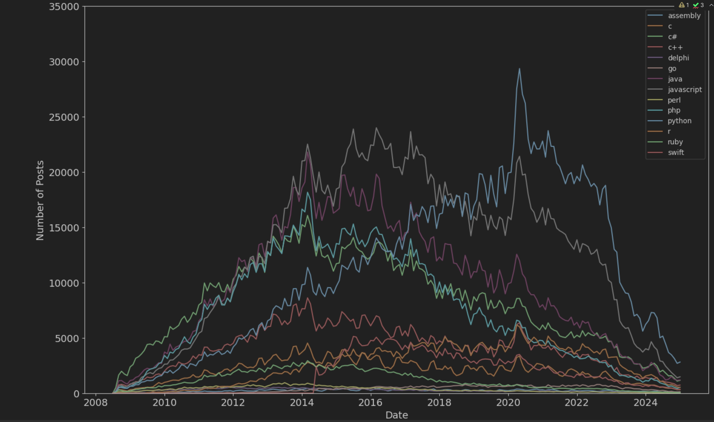

# Programming Languages Popularity Analysis

## 📌 Overview
This project analyzes the popularity of programming languages over time using data from Stack Overflow. It fetches data via an SQL query and processes it using **Python** for visualization and insights.
## 📸 Snapshot


## 📊 Data Source
The dataset is obtained from **Stack Overflow's Data Explorer** using the following SQL query:

```sql
-- Query: Programming Languages Popularity Over Time
SELECT 
  DATEADD(MONTH, DATEDIFF(MONTH, 0, p.CreationDate), 0) AS [Month],
  t.TagName,
  COUNT(*) AS [RequestCount]
FROM Posts p
JOIN PostTags pt ON p.Id = pt.PostId
JOIN Tags t ON pt.TagId = t.Id
WHERE t.TagName IN ('java', 'c', 'c++', 'python', 'c#', 'javascript', 'assembly', 'php', 'perl', 'ruby', 'visual basic', 'swift', 'r', 'object-c', 'scratch', 'go', 'delphi')
  AND p.CreationDate < DATEADD(MONTH, DATEDIFF(MONTH, 0, GETDATE()), 0)
GROUP BY 
  DATEADD(MONTH, DATEDIFF(MONTH, 0, p.CreationDate), 0), 
  t.TagName
ORDER BY 
  [Month] ASC, 
  [RequestCount] DESC;
```

## 📂 Repository Structure
```
📦 Programming_Languages_Popularity
├── 📜 Programming_Languages_Popularity.ipynb  # Jupyter Notebook for analysis
├── 📜 QueryResults.csv                        # Data File
├── 📜 README.md                               # Documentation
```

## 🛠 Libraries Used
The following Python libraries are used for data processing and visualization:
- `pandas` - for data manipulation
- `matplotlib.pyplot` - for visualizing trends

## ⚡ Getting Started
### Prerequisites
Ensure you have Python and Jupyter Notebook installed:
```sh
python --version
pip install pandas matplotlib
```

### Running the Notebook
To run the analysis, open Jupyter Notebook and execute the cells:
```sh
jupyter notebook Programming_Languages_Popularity.ipynb
```

## 📜 License
This project is open-source and available under the MIT License.

## 📬 Contact
For any questions or suggestions, feel free to reach out:
- GitHub: [dawidkocma](https://github.com/dawidkocma)

